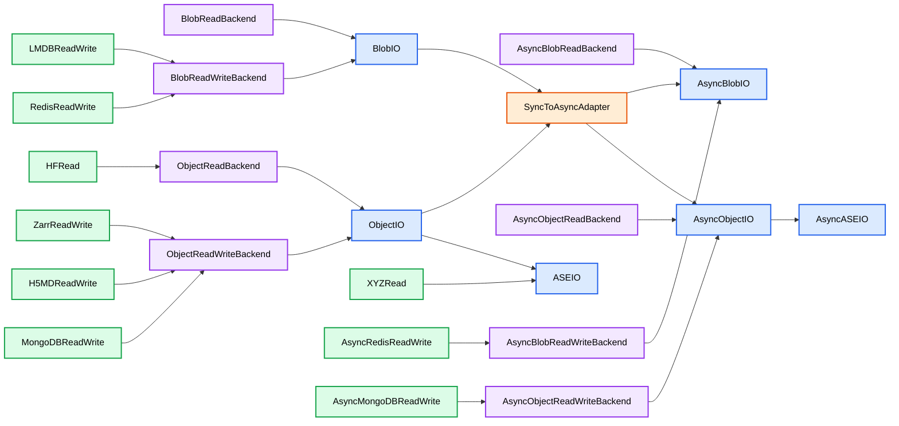

# Unified Trajectory Interface for Atomistic Simulation Data

## SOTA
most interfaces can read a multitude of different file formats, (MDAnalysis, chemfiles, ase, ...) but their focus is on local MD trajectories.
Are rare exception is https://github.com/Becksteinlab/zarrtraj support for MDAnalysis to r/w cloud-native zarr files.
An ASE which can connect to SQL storage (including remote postrgresql)

## Challange
Machine-learned interatomic potentials require
- massive amounts of data (millions+) for foundation models
- hetereogeniouse data with different numbers of datoms / different properties / mutli-fidelity, e.g. energies from different QM methods
- searchabilitiy, e.g. I have ethanol, how many other ethanols are there (smiles?) but also structural similiarity and ideally hash lookups on the atomic positions
- high performance with streaming and caching support for data training

## Design
- `MutableSequence[ase.Atoms]` as interface for reading / writing 
- fileformat agnostic, e.g. support for LMDB, H5, Zarr, XYZ

## Standards
- H5MD (znh5md library)
- ZarrTraj
- SQL / nosql

## Questions
- What file formats for cloude native are required, e.g. parquet? Storage on huggingface?
- Highest performance
- data prefetching
- torch / tf dataloader support
- ASE is great, but direct property to numpy support is also important
- REDIS cache support / middleware for maximum performance sensible?

Use context7 on all relevant libraries and standards.
Use context7 to find existing tooling from the ML / data science and atomistic community that can partially solve this.

