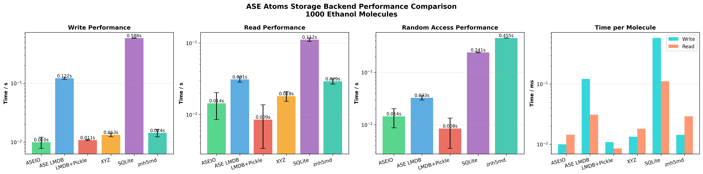

# asebytes

Efficient serialization and storage for ASE Atoms objects with pluggable backends and lazy column-oriented access.

## API

### Storage

- **`ASEIO(file)`** - Storage-agnostic mutable sequence for ASE Atoms objects
- **`BytesIO(file, prefix)`** - Low-level LMDB-backed storage for bytes dictionaries

### Serialization

- **`encode(atoms)`** / **`decode(data)`** - Serialize/deserialize Atoms to/from bytes
- **`atoms_to_dict(atoms)`** / **`dict_to_atoms(data)`** - Convert Atoms to/from logical dicts (no serialization, ~5x faster)

### Backends

- **`LMDBBackend(file)`** - Read-write LMDB backend
- **`LMDBReadOnlyBackend(file)`** - Read-only LMDB backend
- **`ASEReadOnlyBackend(file)`** - Read-only backend for ASE file formats (`.xyz`, `.extxyz`, `.traj`)
- **`HuggingFaceBackend(dataset, mapping)`** - Read-only backend for HuggingFace Datasets (`pip install asebytes[hf]`)
- **`ColumnMapping`** - Maps HF dataset columns to asebytes convention; presets: `COLABFIT`, `OPTIMADE`
- **`ReadableBackend`** / **`WritableBackend`** - Abstract base classes for custom backends

### Views

- **`RowView`** - Lazy view over a subset of rows, yields `ase.Atoms` on iteration
- **`ColumnView`** - Lazy view over one or more columns, avoids constructing full Atoms objects

## Examples

```python
from asebytes import ASEIO
import molify

ethanol = molify.smiles2conformers("CCO", numConfs=1000)

# Store Atoms objects
db = ASEIO("conformers.lmdb")
db.extend(ethanol)

# Integer indexing returns ase.Atoms
mol = db[0]

# Slicing returns a lazy RowView
view = db[5:10]       # no data loaded yet
for atoms in view:    # streams one at a time
    print(atoms)

# Chunked iteration for throughput on large datasets
for atoms in db[:].chunked(1000):  # loads 1000 rows at a time
    process(atoms)

# String indexing returns a lazy ColumnView
energies = db["calc.energy"]          # single column
energies_list = energies.to_list()    # materialize

# Multi-column access
cols = db[["calc.energy", "calc.forces"]]
cols_dict = cols.to_dict()  # {"calc.energy": [...], "calc.forces": [...]}

# Chaining: slice rows then select columns
db[0:100]["calc.energy"].to_list()

# Read-only access
db_ro = ASEIO("conformers.lmdb", readonly=True)

# Read ASE file formats directly (read-only, lazy loading)
traj = ASEIO("trajectory.xyz")
atoms = traj[0]            # reads single frame on demand
for atoms in traj:         # streams frames, discovers length
    process(atoms)

# Partial updates (only writes changed keys)
# Keys must use namespaces: calc.*, info.*, arrays.*
db.update(0, {"info.tag": "optimized"})
db.update(0, calc={"energy": -10.5})

# HuggingFace Datasets via URI prefixes (pip install asebytes[hf])
# ColabFit datasets (auto-selects column mapping, streams by default)
db = ASEIO("colabfit://mlearn_Cu_train", split="train")
atoms = db[0]
for atoms in db:
    process(atoms)

# OPTIMADE-style datasets (e.g. LeMaterial)
db = ASEIO("optimade://LeMaterial/LeMat-Bulk", split="train", name="compatible_pbe")

# Generic HuggingFace datasets (requires explicit column mapping)
from asebytes import ColumnMapping
mapping = ColumnMapping(
    positions="pos", numbers="nums",
    calc={"energy": "total_energy"},
)
db = ASEIO("hf://user/dataset", mapping=mapping, split="train")

# Downloaded mode for random access (loads full dataset)
db = ASEIO("colabfit://mlearn_Cu_train", split="train", streaming=False)
energies = db["calc.energy"].to_list()
```

## Benchmarks

Performance comparison for 1000 ethanol molecules with calculator results:


