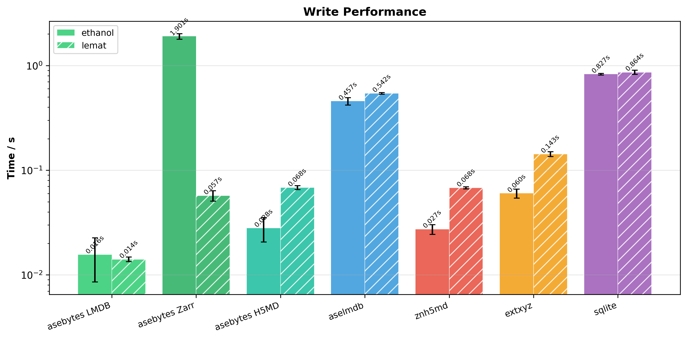
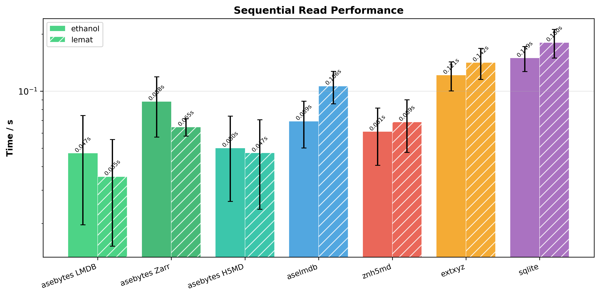
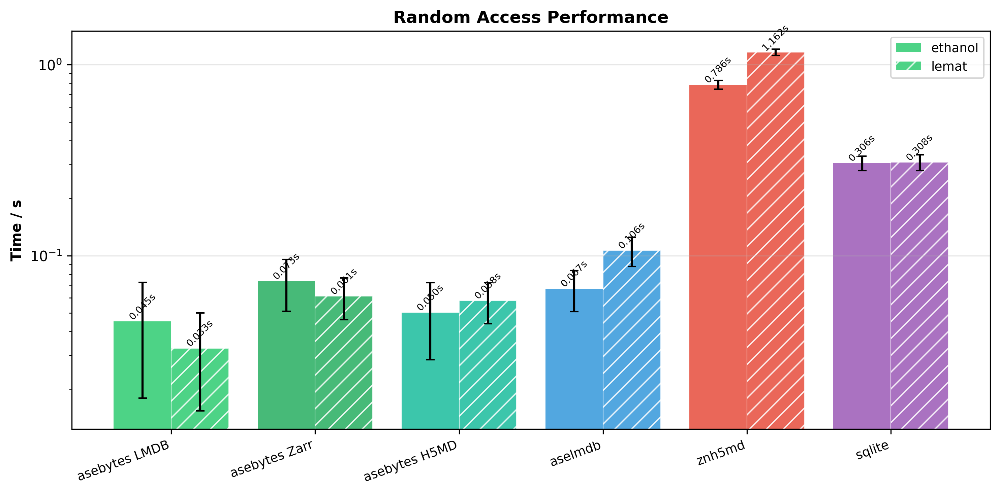
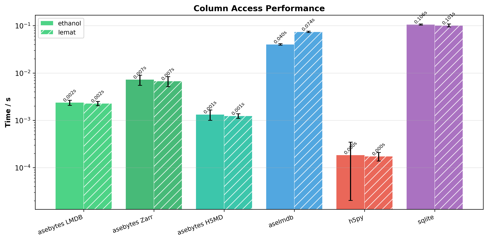
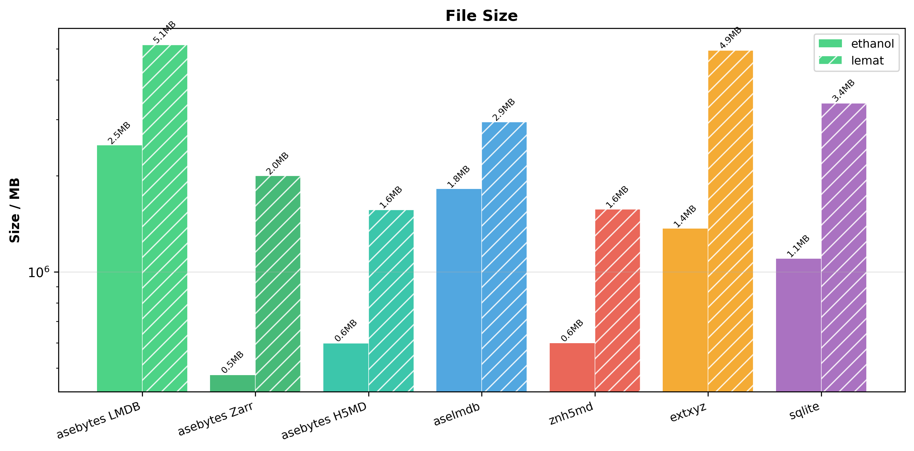

# asebytes

Storage-agnostic, lazy-loading interface for [ASE](https://wiki.fysik.dtu.dk/ase/) Atoms objects. Pluggable backends (LMDB, Zarr, HDF5/H5MD, HuggingFace Datasets, ASE file formats) behind a single `list`-like API with pandas-style column views.

```
pip install asebytes[lmdb]      # LMDB backend (recommended)
pip install asebytes[zarr]      # Zarr backend (fast compression)
pip install asebytes[h5md]      # HDF5/H5MD backend
pip install asebytes[hf]        # HuggingFace Datasets backend
```

## Quick Start

```python
from asebytes import ASEIO

# Write
db = ASEIO("data.lmdb")
db.extend(atoms_list)           # bulk append
db[0] = new_atoms               # replace row
db.update(0, calc={"energy": -10.5})  # partial update

# Read
atoms = db[0]                   # ase.Atoms
atoms = db[-1]                  # negative indexing
```

Backend is auto-detected from the file extension:

| Extension | Backend | Install extra |
|-----------|---------|---------------|
| `*.lmdb` | `LMDBBackend` | `asebytes[lmdb]` |
| `*.zarr` | `ZarrBackend` | `asebytes[zarr]` |
| `*.h5` / `*.h5md` | `H5MDBackend` | `asebytes[h5md]` |
| `*.xyz` / `*.extxyz` / `*.traj` | `ASEReadOnlyBackend` | *(none)* |

## Lazy Views

Indexing with slices, lists, or strings returns lazy views that load data on demand.

```python
# Row views — lazy, stream one frame at a time
view = db[5:100]                # slice → RowView (nothing loaded yet)
view = db[[0, 42, 99]]         # list of indices → RowView
for atoms in view:
    process(atoms)

# Chunked iteration — loads N rows per batch for throughput
for atoms in db[:].chunked(1000):
    process(atoms)

# Column views — avoid constructing full Atoms objects
energies = db["calc.energy"].to_list()
cols = db[["calc.energy", "calc.forces"]].to_dict()
# → {"calc.energy": [...], "calc.forces": [...]}

# Chaining — slice rows, then select columns
db[0:500]["calc.energy"].to_list()
```

## Persistent Read-Through Cache

For slow or remote sources, `cache_to` creates a persistent local cache.
First pass reads from source and fills the cache; all subsequent reads are served from cache.

```python
db = ASEIO("colabfit://dataset", split="train", cache_to="cache.lmdb")

for atoms in db:    # epoch 1: reads source, populates cache
    train(atoms)
for atoms in db:    # epoch 2+: all reads from local cache
    train(atoms)
```

Accepts a file path (auto-creates backend) or any `WritableBackend` instance.
No invalidation — delete the cache file to reset.

## HuggingFace Datasets

Stream or download datasets from the HuggingFace Hub via URI schemes.

```python
# ColabFit (auto-selects column mapping, streams by default)
db = ASEIO("colabfit://mlearn_Cu_train", split="train")

# OPTIMADE (e.g. LeMaterial)
db = ASEIO("optimade://LeMaterial/LeMat-Bulk", split="train", name="compatible_pbe")

# Generic HuggingFace (requires explicit column mapping)
from asebytes import ColumnMapping
mapping = ColumnMapping(
    positions="pos", numbers="nums",
    calc={"energy": "total_energy"},
)
db = ASEIO("hf://user/dataset", mapping=mapping, split="train")

# Downloaded mode for faster access
db = ASEIO("colabfit://dataset", split="train", streaming=False)
```

## Zarr

Zarr backend with flat layout and Blosc/LZ4 compression. Offers compact file sizes and fast read performance. Supports variable particle counts via NaN padding, append-only writes.

```python
db = ASEIO("trajectory.zarr")
db.extend(atoms_list)

# Custom compression
from asebytes import ZarrBackend
db = ASEIO(ZarrBackend("data.zarr", compressor="zstd", clevel=9))
```

## HDF5 / H5MD

H5MD-standard files with support for variable particle counts, per-frame PBC, and bond connectivity.

```python
db = ASEIO("trajectory.h5", author_name="Jane Doe", compression="gzip")
db.extend(atoms_list)

# Multi-group files
from asebytes import H5MDBackend
groups = H5MDBackend.list_groups("multi.h5")
db = ASEIO("multi.h5", particles_group="solvent")
```

## Key Convention

All data follows a flat namespace:

| Prefix | Content | Examples |
|--------|---------|----------|
| `arrays.*` | Per-atom arrays | `arrays.positions`, `arrays.numbers`, `arrays.forces` |
| `calc.*` | Calculator results | `calc.energy`, `calc.stress` |
| `info.*` | Frame metadata | `info.smiles`, `info.label` |
| *(top-level)* | `cell`, `pbc`, `constraints` | |

```python
from asebytes import atoms_to_dict, dict_to_atoms

d = atoms_to_dict(atoms)   # Atoms → flat dict (~5x faster than encode/decode)
atoms = dict_to_atoms(d)   # flat dict → Atoms
```

## Custom Backends

Implement `ReadableBackend` for read-only or `WritableBackend` for read-write:

```python
from asebytes import ASEIO, ReadableBackend

class MyBackend(ReadableBackend):
    def __len__(self): ...
    def columns(self, index=0): ...
    def read_row(self, index, keys=None): ...

db = ASEIO(MyBackend())
```

## Benchmarks

1000 frames each on two datasets — ethanol conformers (small molecules, fixed size) and [LeMat-Traj](https://huggingface.co/datasets/LeMaterial/LeMat-Traj) (periodic structures, variable atom counts). All frames include energy, forces, and stress. Compared against aselmdb, znh5md, extxyz, and SQLite.

```python
# LeMat-Traj benchmark data
lemat = list(ASEIO("optimade://LeMaterial/LeMat-Traj", split="train", name="compatible_pbe")[:1000])
```

> **Note:** HDF5 performance is heavily influenced by compression and chunking settings. Both asebytes H5MD and znh5md use gzip compression by default, which reduces file size at the cost of read/write speed. The Zarr backend uses Blosc/LZ4 compression, which achieves compact file sizes with faster decompression than gzip.

### Write


### Sequential Read


### Random Access


### Column Access


### File Size

