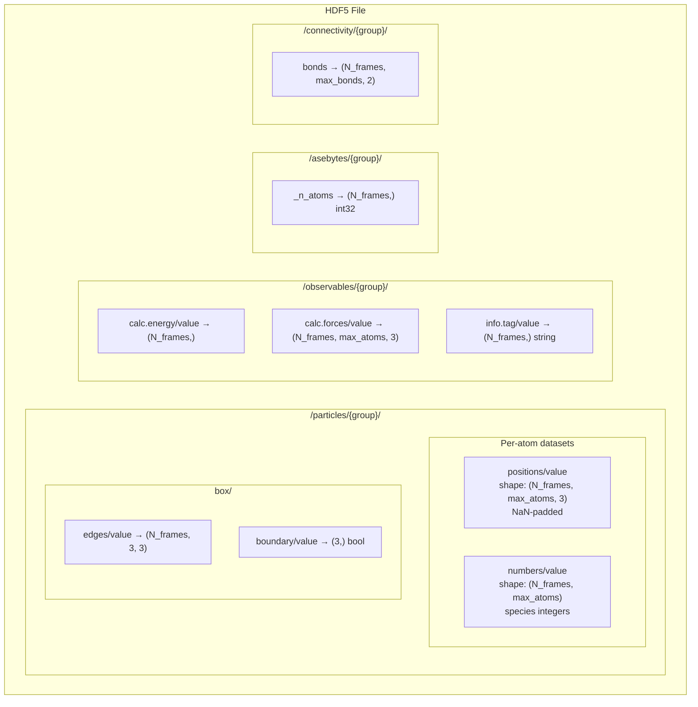
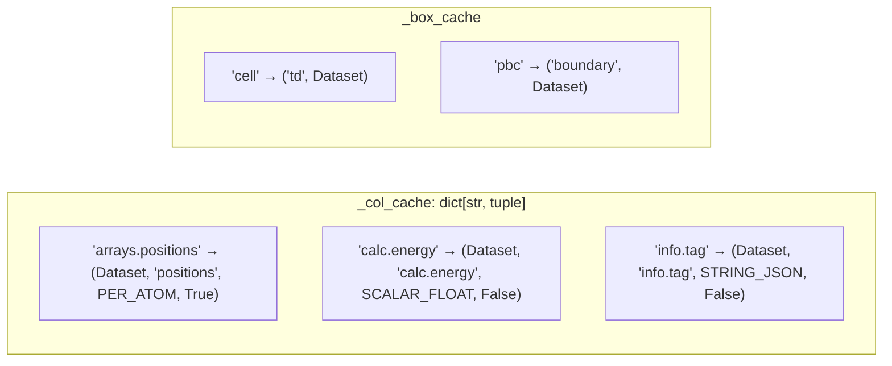
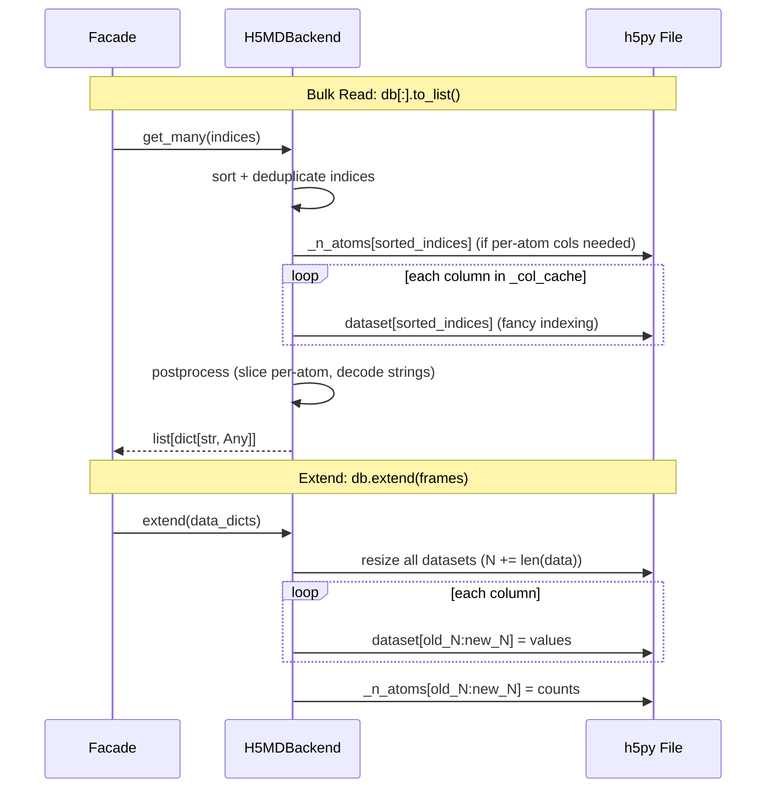

# H5MD Backend

**Layer:** Object (`ReadWriteBackend[str, Any]`)
**Async:** `SyncToAsyncAdapter` only (no native async)
**File:** `src/asebytes/h5md/_backend.py`

## Storage Layout

**Placement rules:**
- Per-atom arrays (positions, numbers, forces) → `/particles/`
- Scalars and non-per-atom → `/observables/`
- `_n_atoms` auxiliary → `/asebytes/`
- Variable particle count: per-atom arrays padded with NaN to `max_atoms`

## Column Cache

Each entry: `(h5py.Dataset, h5_name, _PostProc enum, is_per_atom: bool)`

## Read/Write Flow

## Performance

| Operation | Complexity | Notes |
|-----------|-----------|-------|
| `len()` | O(1) | First dataset shape[0] |
| `get(i)` | O(C) | C = number of columns, one HDF5 read each |
| `get_many(N)` | O(C) | Fancy indexing per column, h5py optimizes contiguous ranges |
| `get_column(key)` | O(1) | Direct dataset slice |
| `extend(N)` | O(C×N) | Resize + write per column |
| `schema()` | O(C) | O(1) per column — reads dtype/shape from Dataset metadata |
| `insert/delete` | — | Not supported (append-only) |

**Benchmark (1000 ethanol, local):**

| Operation | Time |
|-----------|------|
| Trajectory read | 28ms |
| Single read ×1000 | 139ms |
| Column energy | 0.4ms |
| Write trajectory | 23ms |
| Write single ×1000 | 1527ms |

**Single-row overhead:** Each `db[i]` reads every column dataset independently. 139ms / 1000 = 0.14ms/row. Acceptable but slower than LMDB due to per-column HDF5 seeks.

## Sync/Async Consistency

No native async backend. Async via `SyncToAsyncAdapter` + `asyncio.to_thread()`.

h5py is not thread-safe by default. `SyncToAsyncAdapter` uses `asyncio.to_thread` which runs in a thread pool — must ensure only one thread accesses the file at a time.

## Potential Optimizations

- **O(1) schema:** Already implemented — reads dtype/shape from dataset metadata without loading data.
- **Conditional `_n_atoms`:** Already implemented — `_needs_n_atoms()` skips reading `_n_atoms` when no per-atom columns are requested.
- **Single-row reads:** Inherent overhead from per-column HDF5 seek. Could batch column reads with a single `h5py.File` context, but already doing so.
- **Write single:** 1527ms for 1000 single writes. Each `extend([frame])` resizes all datasets. Consider documenting that bulk `extend()` is 66× faster than single writes.
