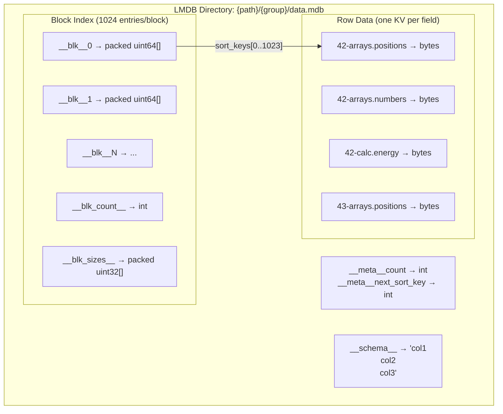
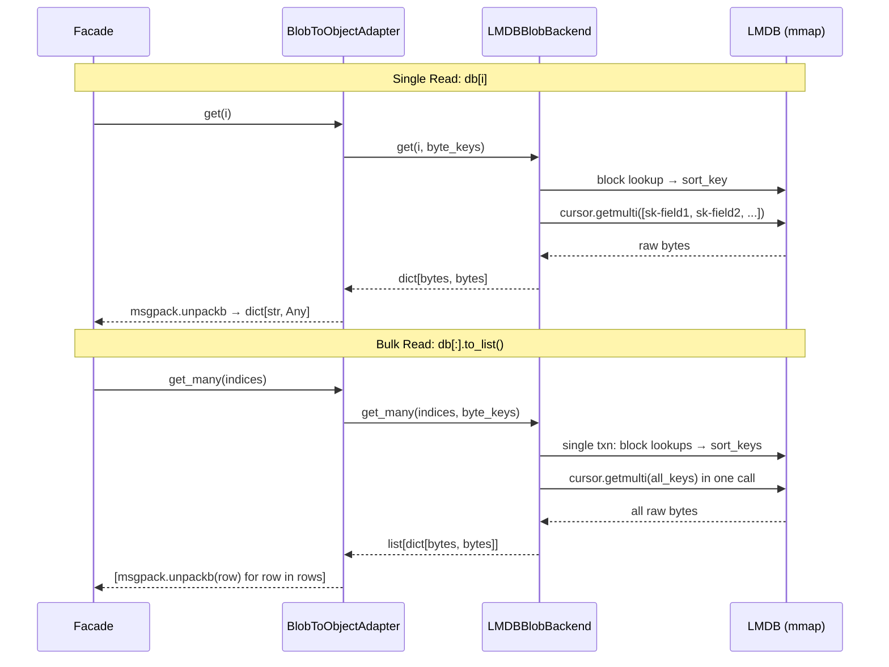

# LMDB Backend

**Layer:** Blob (`ReadWriteBackend[bytes, bytes]`)
**Object access:** `BlobToObjectReadWriteAdapter` (msgpack + msgpack_numpy)
**Async:** `SyncToAsyncAdapter` only (no native async)
**Files:** `src/asebytes/lmdb/_blob_backend.py`, `_backend.py`

## Storage Layout

**Key format:** `{sort_key}-{field_name}` — each field stored as a separate LMDB key-value pair.

**Block index:** Decouples positional indices from sort keys. Blocks hold up to 1024 packed uint64 sort keys. Enables O(1) positional lookup without scanning.

**Schema union:** `__schema__` stores the union of all field names ever written (newline-separated). Used by `get_column()` to know which fields exist.

## Read/Write Flow

## Performance

| Operation | Complexity | Notes |
|-----------|-----------|-------|
| `len()` | O(1) | Cached `__meta__count`, invalidated on write |
| `get(i)` | O(1) | Block lookup + `cursor.getmulti` |
| `get_many(N)` | O(N) | Single LMDB transaction, one `cursor.getmulti` |
| `get_column(key, N)` | O(N) | Single txn, `cursor.getmulti` for one field across N rows |
| `extend(N)` | O(N) | `cursor.putmulti`, block append |
| `set(i)` | O(F) | F = number of fields, delete old + write new |
| `delete(i)` | O(B) | B = block size, may rewrite block |
| `insert(i)` | O(B) | Block split if needed |

**Benchmark (1000 ethanol, local):**

| Operation | Time |
|-----------|------|
| Trajectory read | 24ms |
| Single read ×1000 | 23ms |
| Column energy | 0.6ms |
| Write trajectory | 14ms |

## Sync/Async Consistency

No native async backend. Async access via `SyncToAsyncAdapter` wrapping `LMDBBlobBackend` with `asyncio.to_thread()`.

## Potential Optimizations

Already optimal for the use case. mmap provides zero-copy reads. `cursor.getmulti` batches all field reads into one syscall. Block index keeps positional lookups O(1).

No changes recommended.
