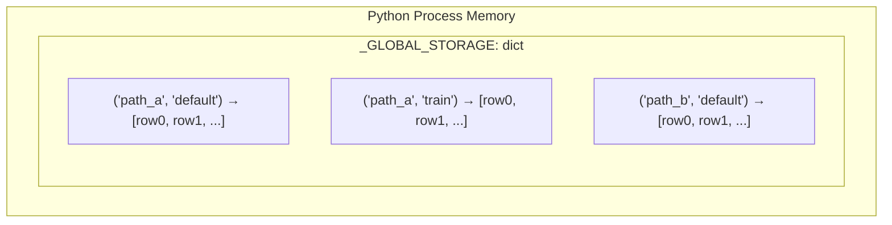
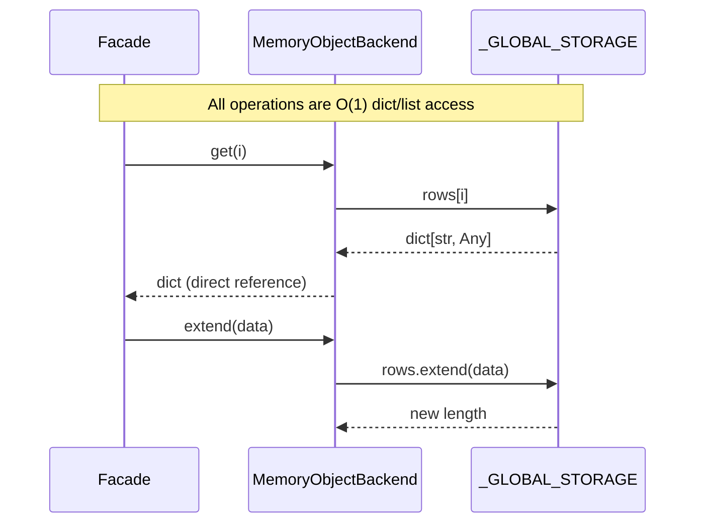

# Memory Backend

**Layer:** Object (`ReadWriteBackend[str, Any]`)
**Async:** **None** (sync-only, no `AsyncMemoryObjectBackend`)
**File:** `src/asebytes/memory/_backend.py`

## Storage Layout



**Global dict:** `_GLOBAL_STORAGE` keyed by `(path, group)` tuple. Multiple `MemoryObjectBackend` instances with the same path+group share the same underlying list.

**Row storage:** Plain Python `list[dict[str, Any] | None]`. No serialization, no copy overhead.

## Read/Write Flow



## Performance

| Operation | Complexity | Notes |
|-----------|-----------|-------|
| `len()` | O(1) | `len(rows)` |
| `get(i)` | O(1) | Direct list index |
| `get_many(N)` | O(N) | List comprehension |
| `get_column(key, N)` | O(N) | Dict key access per row |
| `extend(N)` | O(N) | `list.extend()` |
| `set(i)` | O(1) | `rows[i] = data` |
| `delete(i)` | O(N) | `list.pop(i)` — shifts subsequent |
| `insert(i)` | O(N) | `list.insert(i)` — shifts subsequent |

Fastest possible backend — no I/O, no serialization, no network.

## Sync/Async Consistency

**No async variant exists.** `AsyncASEIO("memory://test")` would use `SyncToAsyncAdapter` to wrap the sync backend, which works but adds `asyncio.to_thread()` overhead for what are essentially instant in-memory operations.

**Recommendation:** Document as sync-only. An `AsyncMemoryObjectBackend` is straightforward to create but low priority — the operations are so fast that `asyncio.to_thread()` overhead dominates.

## URI Format

```
memory://path/group
```

Example: `ASEIO("memory://my_dataset")` → path=`my_dataset`, group=`default`

## Potential Optimizations

None needed — already optimal. Zero I/O, zero serialization.
