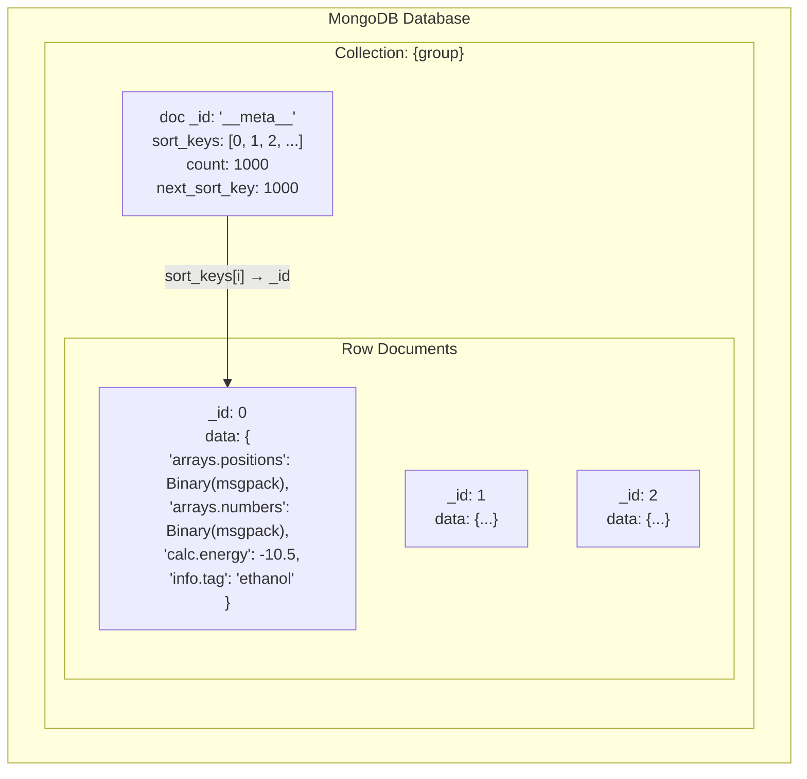
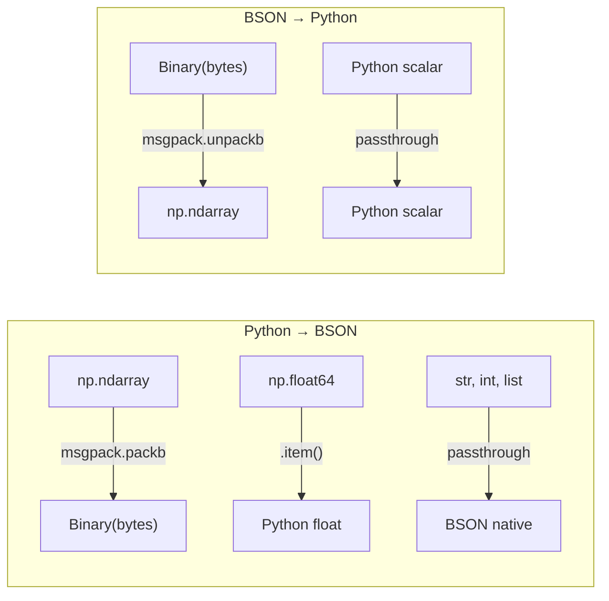
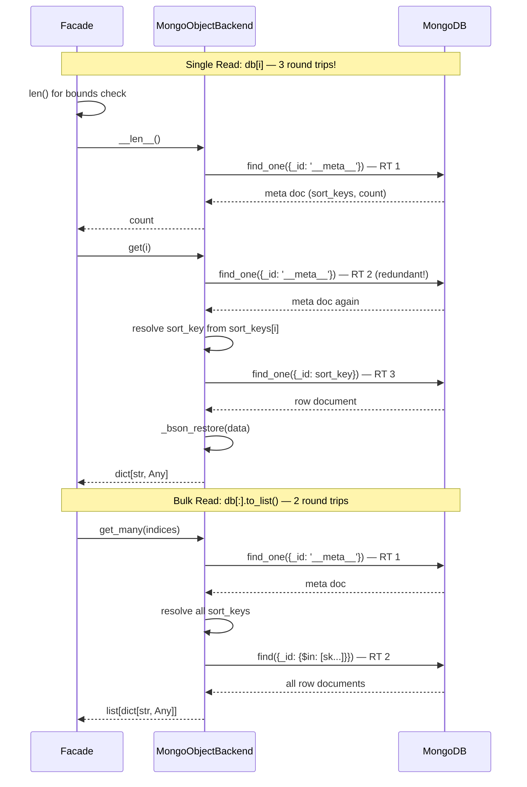

# MongoDB Backend

**Layer:** Object (`ReadWriteBackend[str, Any]`)
**Async:** **Native** `AsyncMongoObjectBackend` (pymongo `AsyncMongoClient`)
**Files:** `src/asebytes/mongodb/_backend.py`, `_async_backend.py`

## Storage Layout



**Positional access:** `__meta__.sort_keys[i]` → sort key → document `_id`.
**Group isolation:** Each group = separate MongoDB collection.
**None rows:** Document exists with `data: null`.

## Serialization



numpy arrays are wrapped in `Binary(msgpack)` to preserve dtype/shape through BSON round-trip.

## Read/Write Flow



## Performance

| Operation | Round Trips | Notes |
|-----------|-------------|-------|
| `len()` | 1 | `_ensure_cache()` → `find_one(__meta__)` |
| `get(i)` | 2 | `_ensure_cache()` + `find_one(sk)` |
| `get_many(N)` | 2 | `_ensure_cache()` + `find({$in: sks})` |
| `get_column(key, N)` | 2 | `_ensure_cache()` + `find({$in: sks}, projection)` |
| `extend(N)` | 3 | `find_one_and_update($inc)` + `insert_many` + `update_one($push)` |
| `update(i)` | 3 | `_ensure_cache()` + materialize null + `$set` |
| `set(i)` | 2 | `_ensure_cache()` + `replace_one` |

**Facade adds +1 RT** for bounds checking: `db[i]` → `len()` → `_ensure_cache()` (RT1), then `get()` → `_ensure_cache()` again (RT2) + `find_one` (RT3) = **3 RT per single read**.

**Benchmark (1000 ethanol, localhost):**

| Operation | Time |
|-----------|------|
| Trajectory read | 31ms |
| Single read ×1000 | 925ms |
| Column energy | 5.4ms |
| Write trajectory | 43ms |
| Write single ×1000 | 1958ms |

## Sync/Async Consistency

| Aspect | Sync | Async | Issue? |
|--------|------|-------|--------|
| Client | `MongoClient` | `AsyncMongoClient` | None — both pymongo |
| Cache | `_ensure_cache()` sync | `async _ensure_cache()` | Expected |
| Close | `self._client.close()` | Defensive: try `loop.create_task(close)` | Async has sync fallback |
| Serialization | `_bson_safe`/`_bson_restore` | Same functions imported | None |
| Context manager | `__enter__`/`__exit__` | `__aenter__`/`__aexit__` | Expected |

Sync and async backends are well-mirrored. No significant inconsistencies.

## The `_ensure_cache()` Problem

**Current behavior:** Every read operation calls `_ensure_cache()`, which does `find_one({"_id": "__meta__"})` fetching the full metadata document including the sort_keys array. This is the single largest performance bottleneck.

**Key insight:** `sort_keys` only changes on **structural operations** (extend, insert, delete, clear). Data operations (set, update, update_many, set_column, drop_keys) do NOT modify sort_keys.

**Current invalidation is over-broad:** `set()` calls `_invalidate_cache()` even though it doesn't change sort_keys.

## Potential Optimizations

### 1. Lazy metadata cache with TTL (recommended)

Guard `_ensure_cache()` with a TTL. Sort_keys metadata is loaded once and reused until TTL expires or a structural write occurs.

```python
import time

def __init__(self, ..., cache_ttl: float = 30.0):
    ...
    self._cache_loaded_at: float = 0.0
    self._cache_ttl = cache_ttl

def _ensure_cache(self) -> None:
    now = time.monotonic()
    if self._sort_keys is not None and (now - self._cache_loaded_at) < self._cache_ttl:
        return  # within TTL
    meta = self._col.find_one({"_id": META_ID})
    self._sort_keys = meta.get("sort_keys", []) if meta else []
    self._count = meta.get("count", len(self._sort_keys)) if meta else 0
    self._cache_loaded_at = now
```

**Correct invalidation scope:**

| Method | Changes sort_keys? | Should invalidate? |
|--------|-------------------|-------------------|
| `extend()` | Yes | Yes |
| `insert()` | Yes | Yes |
| `delete()` | Yes | Yes |
| `clear()` | Yes | Yes |
| `set()` | No | **No** (currently does — bug) |
| `update()` | No | No |
| `update_many()` | No | No |
| `set_column()` | No | No |
| `drop_keys()` | No | No |

**TTL = 30s rationale:** Covers both typical use cases:
- Bulk property updates: sort_keys won't change during a read-compute-write pass
- Live MD: tight update loops to existing frames don't modify sort_keys
- Concurrent `extend()` by another client → visible within 30s

**Expected improvement:** 3 RT/row → 1 RT/row for single reads. ~3× faster.

### 2. Fix `set()` invalidation

Remove `_invalidate_cache()` from `set()` — it doesn't modify sort_keys. This is a simple bug fix independent of the TTL change.

### 3. Why not change streams

MongoDB change streams require a **replica set** — they don't work on standalone `mongod`. This breaks development/testing with single-node MongoDB. Also massively over-engineered for metadata invalidation.
