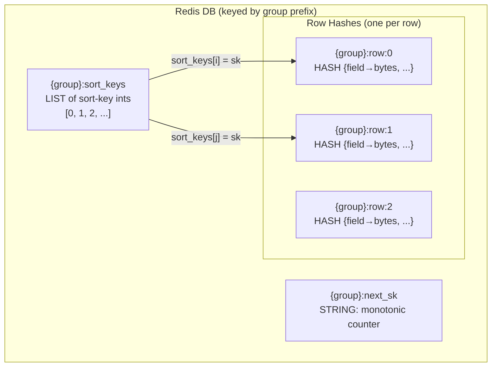
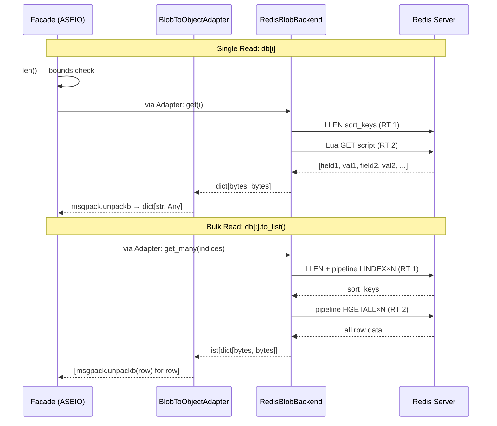

# Redis Backend

**Layer:** Blob (`ReadWriteBackend[bytes, bytes]`)
**Object access:** `BlobToObjectReadWriteAdapter` (msgpack + msgpack_numpy)
**Async:** **Native** `AsyncRedisBlobBackend` (redis.asyncio)
**Files:** `src/asebytes/redis/_backend.py`, `_async_backend.py`, `_lua.py`

## Storage Layout



**Positional access:** `sort_keys` LIST maps positional index → sort key → row hash.
**None rows:** Sort key exists in LIST but no corresponding HASH.
**Sort key allocation:** `INCR {group}:next_sk` — monotonically increasing, never reused.

## Lua Scripts (Atomic Operations)

| Script | Purpose | Round Trips |
|--------|---------|-------------|
| `LUA_GET` | Resolve index → HGETALL | 1 |
| `LUA_GET_WITH_KEYS` | Resolve index → HMGET (filtered) | 1 |
| `LUA_KEYS` | Resolve index → HKEYS | 1 |
| `LUA_SET` | Resolve index → DEL + HSET | 1 |
| `LUA_DELETE` | DEL hash + LREM from sort_keys | 1 |
| `LUA_UPDATE` | Resolve index → HSET (merge) | 1 |

All scripts take `KEYS[1] = sort_keys list`, `ARGV[1] = row prefix`, `ARGV[2] = index`.

## Read/Write Flow



## Performance

| Operation | Round Trips | Notes |
|-----------|-------------|-------|
| `len()` | 1 | `LLEN` |
| `get(i)` | 1 | Lua script (index resolve + HGETALL) |
| `get_many(N)` | 2 | Pipeline LINDEX×N + pipeline HGETALL×N |
| `get_column(key, N)` | 2 | Pipeline LINDEX×N + pipeline (EXISTS+HGET)×N |
| `extend(N)` | 2 | INCRBY + pipeline HSET×N + RPUSH |
| `set(i)` | 1 | Lua SET |
| `delete(i)` | 1 | Lua DELETE |
| `update(i)` | 1 | Lua UPDATE |

**But facade adds +1 RT:** `db[i]` calls `len()` (LLEN) for bounds checking before `get()` = **2 RT total per single read**.

**Benchmark (1000 ethanol, localhost):**

| Operation | Time |
|-----------|------|
| Trajectory read | 45ms |
| Single read ×1000 | 401ms |
| Column energy | 16ms |
| Write trajectory | 31ms |
| Write single ×1000 | 405ms |

## Sync/Async Consistency

| Aspect | Sync | Async | Issue? |
|--------|------|-------|--------|
| Lua scripts | Same 6 scripts from `_lua.py` | Same | None |
| Pipeline | `pipeline()` (default `transaction=True`) | `pipeline(transaction=False)` | **Minor inconsistency** |
| Close | `close()` → `self._r.close()` | `aclose()` → `await self._r.aclose()` | **Missing sync `close()` on async** |
| Context manager | `__enter__`/`__exit__` | `__aenter__`/`__aexit__` | Expected |

### Issue: Pipeline transaction mode

Sync uses default `pipeline()` which implies `transaction=True` (MULTI/EXEC wrapper).
Async explicitly uses `pipeline(transaction=False)` (no MULTI/EXEC).

**Impact:** Minimal — pipeline operations in this backend don't need atomicity (they're read-only batch fetches). The Lua scripts provide atomicity for writes. The async behavior is arguably more correct (less overhead).

### Issue: Missing sync `close()` on async backend

The async backend has `aclose()` but no sync `close()`. If cleanup runs in a sync context (e.g., `__del__`, atexit), there's no fallback. MongoDB's async backend handles this with a defensive try/except.

## Potential Optimizations

### Move bounds checking into Lua → 1 RT/row

**Current:** Facade calls `len()` (LLEN = RT1), then `get()` (Lua = RT2) = 2 RT.

**Proposed:** The Lua scripts already validate indices and raise `IndexError`. The facade's `len()` call is redundant for bounds checking. If the facade skipped `len()` and let the Lua script handle OOB, single reads would drop to 1 RT.

**Implementation:** Change `ASEIO.__getitem__` to catch `IndexError` from backend instead of pre-checking `len()`. Or add a `_returns_bounds_error = True` flag to skip pre-check.

**Expected:** 2 RT → 1 RT per single read ≈ 50% improvement for single-row access (401ms → ~200ms).

### Add sync `close()` to async backend

Add defensive sync close matching MongoDB's pattern:
```python
def close(self) -> None:
    try:
        loop = asyncio.get_running_loop()
        loop.create_task(self._r.aclose())
    except RuntimeError:
        asyncio.run(self._r.aclose())
```
