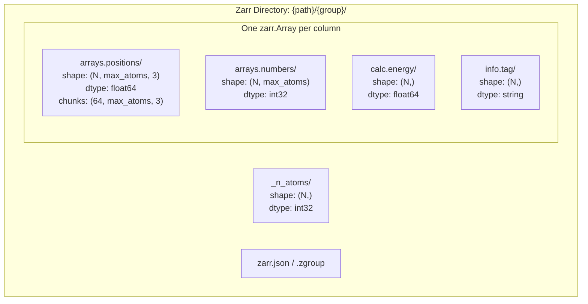
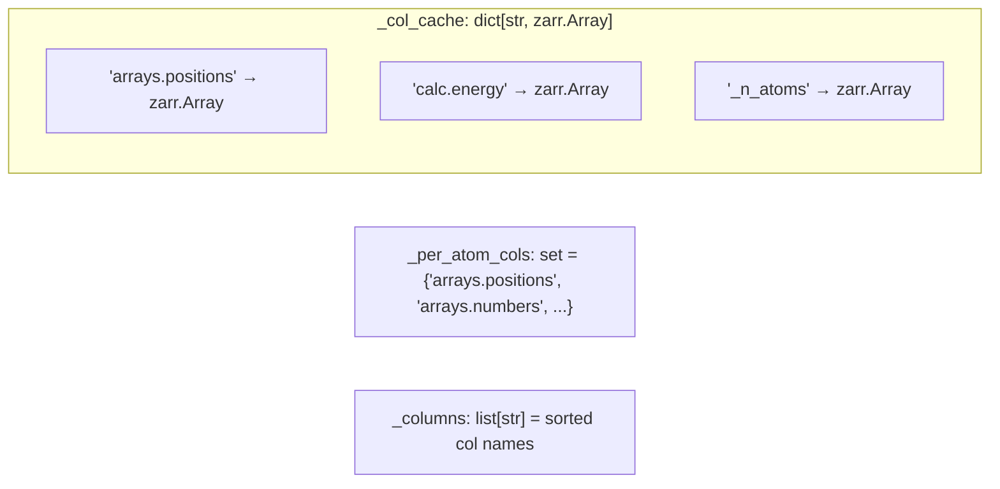
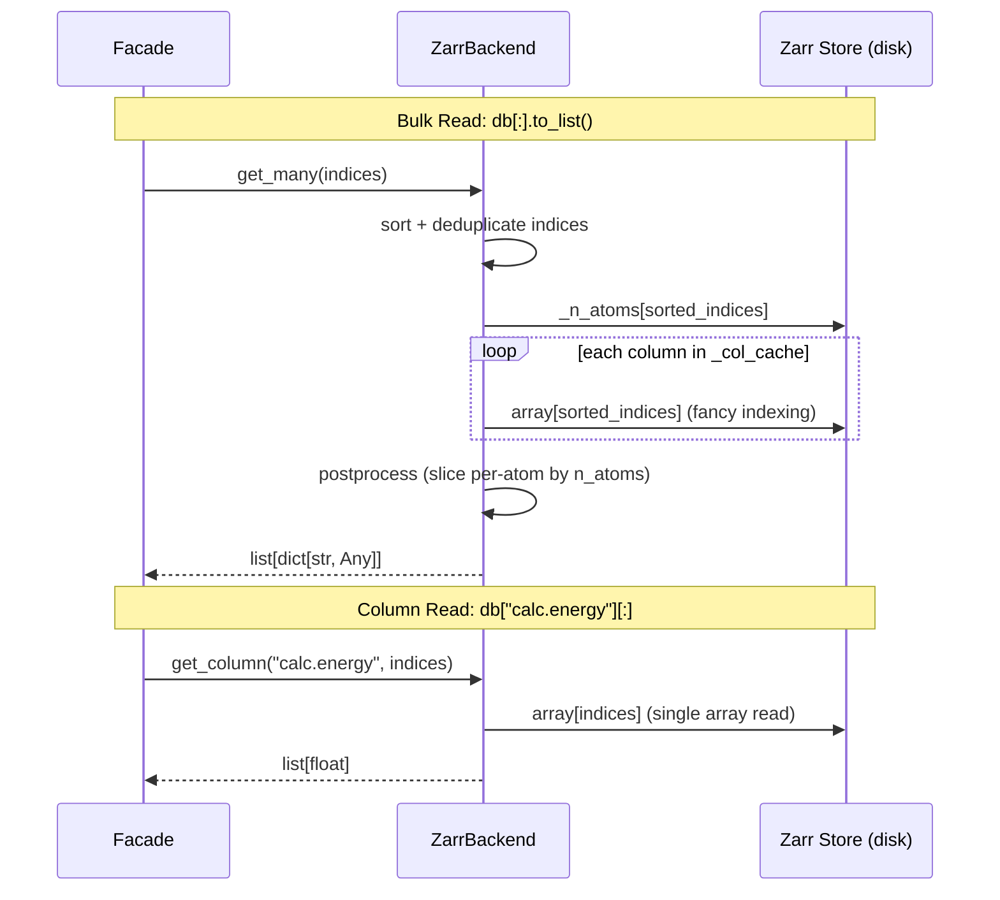

# Zarr Backend

**Layer:** Object (`ReadWriteBackend[str, Any]`)
**Async:** `SyncToAsyncAdapter` only (no native async)
**File:** `src/asebytes/zarr/_backend.py`

## Storage Layout

**Key design:** Flat layout — each column maps directly to one zarr array. Array name = column name.

**Per-atom handling:**
- `_per_atom_cols` set tracks which columns have variable-length per-atom data
- Per-atom arrays padded with fill value (NaN/0) to `max_atoms` dimension
- `_n_atoms` int32 array stores actual particle count per frame for slicing

**Compression:** Blosc codec (lz4/zstd), configurable `clevel`, shuffle enabled.
**Chunking:** `(chunk_frames, *full_shape)` — default `chunk_frames=64`, no chunking on atom/spatial dims.

## Column Cache

## Read/Write Flow

## Performance

| Operation | Complexity | Notes |
|-----------|-----------|-------|
| `len()` | O(1) | First array shape[0] |
| `get(i)` | O(C) | C = number of columns, each array read independently |
| `get_many(N)` | O(C) | Fancy indexing per column, chunk-aware |
| `get_column(key)` | O(1) | **Direct array slice — fastest path** |
| `extend(N)` | O(C×N) | Resize + append per column |
| `schema()` | O(C) | O(1) per column — reads dtype/shape from array metadata |
| `insert/delete` | — | Not supported (append-only) |

**Benchmark (1000 ethanol, local):**

| Operation | Time | Notes |
|-----------|------|-------|
| Trajectory read | 50ms | Good — chunk-aware bulk read |
| Single read ×1000 | 4792ms | **Catastrophic** — per-col file open × N cols × 1000 |
| Column energy | 3.9ms | Fast — single array |
| Write trajectory | 1833ms | Compression overhead |
| Write single ×1000 | 26469ms | Each extend resizes all arrays |

## Why Single-Row Reads Are Slow

Each `db[i]` reads **every column array independently**. With C columns, that's C separate zarr array reads, each involving:
1. Open/seek to chunk containing frame i
2. Decompress chunk (Blosc)
3. Extract single value
4. Repeat for next column

For 1000 rows × ~10 columns = 10,000 chunk decompressions. This is the fundamental cost of column-oriented storage for row-oriented access.

**This is by design.** Zarr excels at column access (`db["positions"][:]`) and bulk reads (`db[:].to_list()`). Users needing fast single-row access should use LMDB.

## Sync/Async Consistency

No native async backend. Async via `SyncToAsyncAdapter` + `asyncio.to_thread()`.

Zarr v3 has native async support (`zarr.open_async`), but this backend currently uses synchronous zarr APIs only.

## Potential Optimizations

- **O(1) schema:** Already implemented.
- **Conditional `_n_atoms`:** Already implemented — skips `_n_atoms` read when no per-atom columns requested.
- **Single-row reads:** Inherent to column-oriented design. No fix without changing storage layout.
- **Row-group caching:** Could cache recently-decompressed chunks in memory. Would help repeated access to nearby frames but violates "no caching" constraint.
- **Zarr v3 async:** Native async zarr could eliminate `SyncToAsyncAdapter` overhead. Future work.
